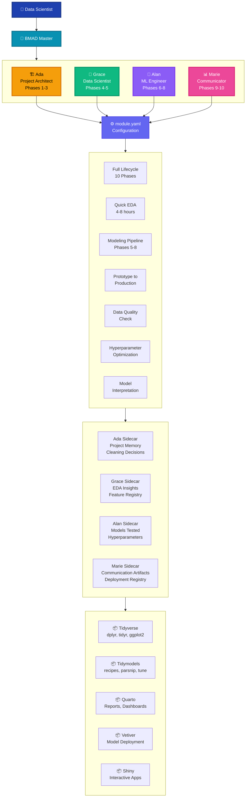
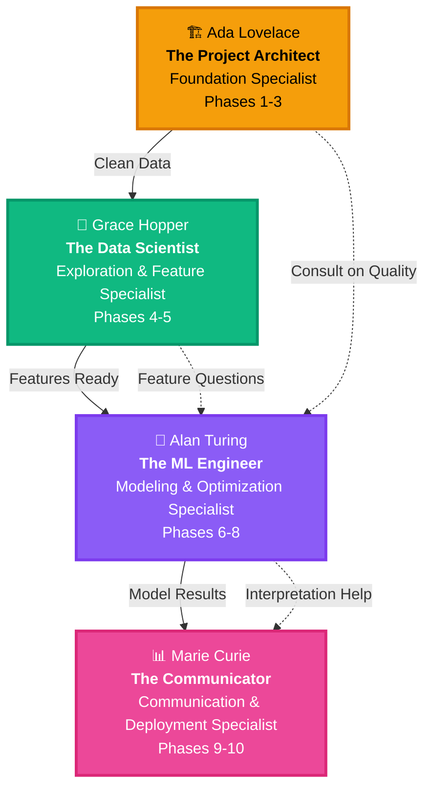
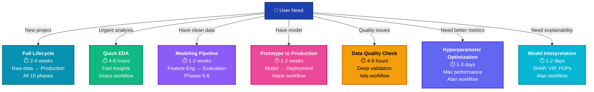
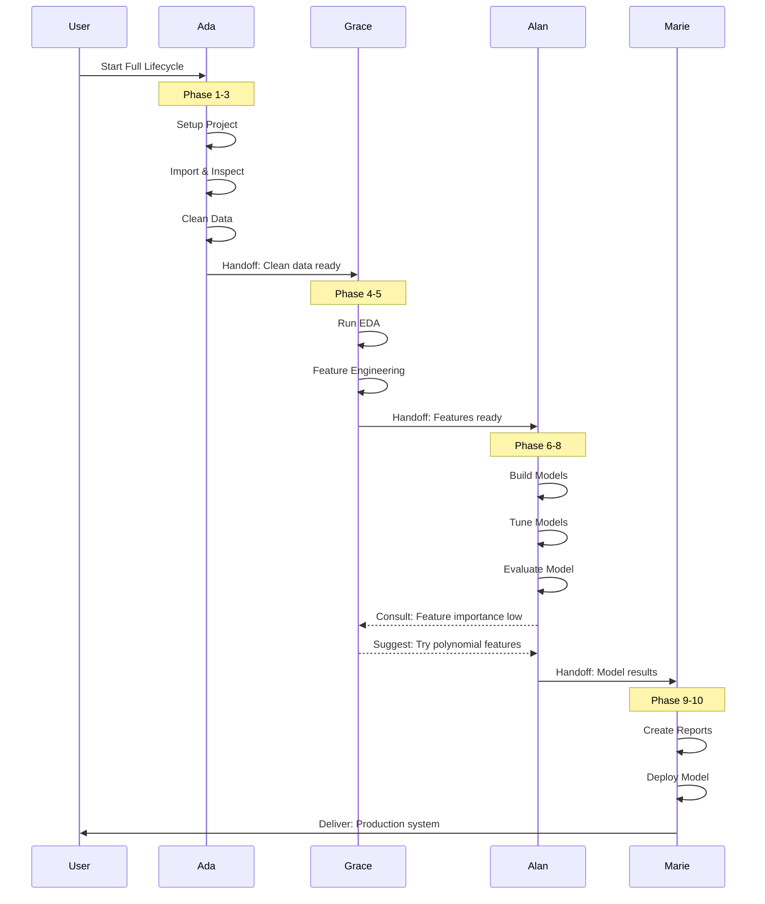
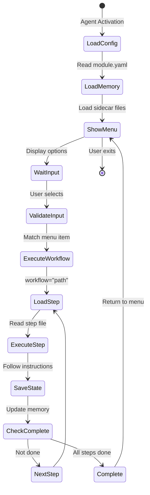
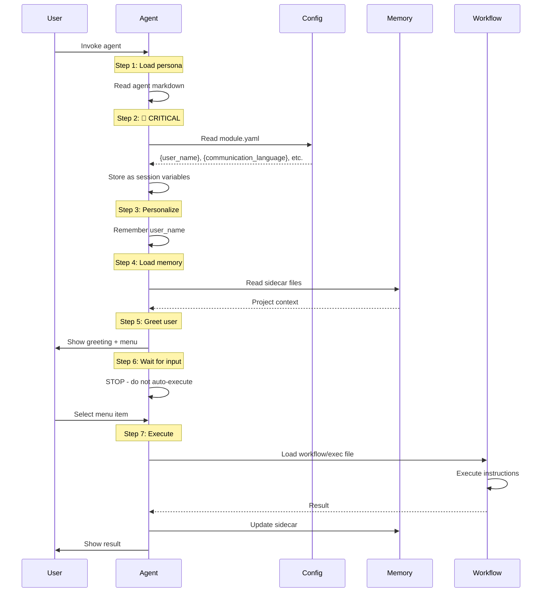
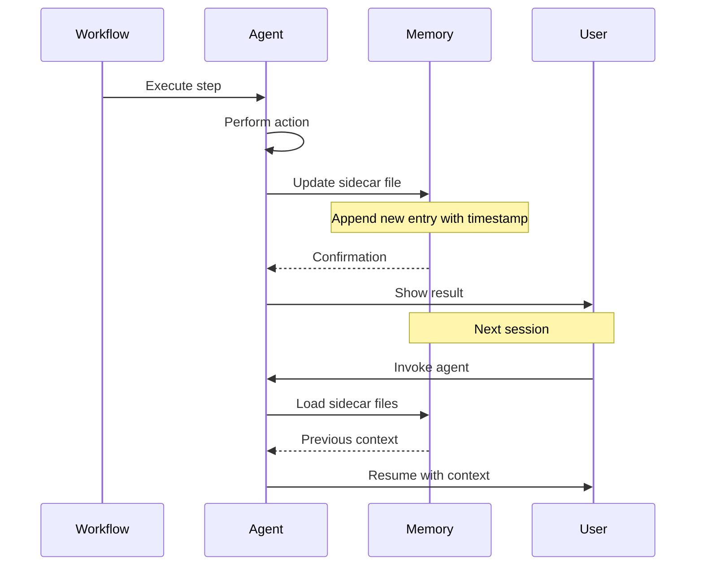

# RDS Module: R Data Science Framework - Architecture Guide

**Version:** 1.0
**Date:** 2026-03-19
**Module:** RDS (R Data Science)
**Framework:** BMAD 6.0.0-alpha.23

---

## Table of Contents

1. [Executive Summary](#executive-summary)
2. [Architecture Overview](#architecture-overview)
3. [The 10-Phase Data Science Lifecycle](#the-10-phase-data-science-lifecycle)
4. [The Four Specialists: Agent System](#the-four-specialists-agent-system)
5. [Workflow System](#workflow-system)
6. [Integration Patterns](#integration-patterns)
7. [Memory & State Management](#memory--state-management)
8. [Usage Examples](#usage-examples)
9. [Technical Deep Dive](#technical-deep-dive)

---

## Executive Summary

The **RDS (R Data Science) Module** is a comprehensive framework that orchestrates the complete data science lifecycle in R, from raw data to production deployment. It solves the "blank canvas syndrome" by providing executable workflows guided by specialized agents, each embodying decades of best practices from the R ecosystem (Tidyverse, Tidymodels, Quarto, Vetiver).

### Key Value Propositions

- **Systematic Approach**: Transforms ad-hoc analysis into reproducible, production-ready pipelines
- **Expert Guidance**: Four specialized agents guide you through 10 phases with best practices embedded
- **Flexibility**: 7 workflows support different entry points (full lifecycle, quick EDA, modeling-only, etc.)
- **Production-Ready**: From exploratory analysis to deployed APIs with monitoring

### Core Components

- **4 Agents**: Ada (Architect), Grace (Data Scientist), Alan (ML Engineer), Marie (Communicator)
- **7 Workflows**: Full-lifecycle, Quick-EDA, Modeling-Pipeline, Prototype-to-Production, Data-Quality-Check, Hyperparameter-Optimization, Model-Interpretation
- **10 Phases**: Setup → Import → Clean → EDA → Feature Engineering → Modeling → Tuning → Evaluation → Communication → Deployment

---

## Architecture Overview

### System Architecture Diagram



### Architectural Principles

1. **Separation of Concerns**: Each agent owns specific phases and maintains isolated memory
2. **Phase-Based Progression**: Sequential phases with validation checkpoints
3. **Flexible Entry Points**: Multiple workflows for different scenarios (full lifecycle, quick exploration, etc.)
4. **Memory Persistence**: Sidecar memory files maintain context across sessions
5. **Best Practice Integration**: R ecosystem standards embedded in agent logic

---

## The 10-Phase Data Science Lifecycle

The RDS framework divides the data science process into 10 distinct phases, distributed across four specialized agents:

```mermaid
graph TD
    Start[🎯 Start Project]

    Start --> Ada_Section[Ada: Foundation 🏗️]

    subgraph Ada_Section[" "]
        P1[Phase 1: Setup<br/>renv, Git, structure<br/>⏱️ 30-60 min]
        P2[Phase 2: Import<br/>Load & inspect<br/>⏱️ 1-2 hours]
        P3[Phase 3: Clean<br/>Wrangle & validate<br/>⏱️ 4-8 hours]
        P1 --> P2 --> P3
    end

    P3 --> Grace_Section[Grace: Exploration 🔬]

    subgraph Grace_Section[" "]
        P4[Phase 4: EDA<br/>Visualize & explore<br/>⏱️ 4-8 hours]
        P5[Phase 5: Feature Eng<br/>Transform & create<br/>⏱️ 1-3 days]
        P4 --> P5
    end

    P5 --> Alan_Section[Alan: Modeling 🤖]

    subgraph Alan_Section[" "]
        P6[Phase 6: Modeling<br/>Baseline & compare<br/>⏱️ 2-4 days]
        P7[Phase 7: Tuning<br/>Optimize params<br/>⏱️ 1-3 days]
        P8[Phase 8: Evaluation<br/>Test & interpret<br/>⏱️ 1-2 days]
        P6 --> P7 --> P8
    end

    P8 --> Marie_Section[Marie: Communication 📊]

    subgraph Marie_Section[" "]
        P9[Phase 9: Communication<br/>Reports & dashboards<br/>⏱️ 2-3 days]
        P10[Phase 10: Deployment<br/>API & monitoring<br/>⏱️ 1-2 days]
        P9 --> P10
    end

    P10 --> End[✅ Production Ready]

    style Start fill:#1e40af,color:#fff,stroke:#1e3a8a,stroke-width:3px
    style End fill:#059669,color:#fff,stroke:#047857,stroke-width:3px
    style P1 fill:#f59e0b,color:#000,stroke:#d97706,stroke-width:3px
    style P2 fill:#f59e0b,color:#000,stroke:#d97706,stroke-width:3px
    style P3 fill:#f59e0b,color:#000,stroke:#d97706,stroke-width:3px
    style P4 fill:#10b981,color:#fff,stroke:#059669,stroke-width:3px
    style P5 fill:#10b981,color:#fff,stroke:#059669,stroke-width:3px
    style P6 fill:#8b5cf6,color:#fff,stroke:#7c3aed,stroke-width:3px
    style P7 fill:#8b5cf6,color:#fff,stroke:#7c3aed,stroke-width:3px
    style P8 fill:#8b5cf6,color:#fff,stroke:#7c3aed,stroke-width:3px
    style P9 fill:#ec4899,color:#fff,stroke:#db2777,stroke-width:3px
    style P10 fill:#ec4899,color:#fff,stroke:#db2777,stroke-width:3px
```



### Phase Details

| Phase | Owner | Duration | Key Activities | Output Artifacts |
|-------|-------|----------|----------------|------------------|
| **1. Setup** | Ada | 30-60 min | Project structure, renv, Git init | `renv.lock`, `.gitignore`, `R/`, `data/` |
| **2. Import** | Ada | 1-2 hours | Load data, glimpse/skim, quality check | `data/raw/`, import scripts, QC report |
| **3. Clean** | Ada | 4-8 hours | Handle missings, outliers, data types | `data/clean/`, cleaning scripts |
| **4. EDA** | Grace | 4-8 hours | Distributions, correlations, visualizations | ggplot2 plots, EDA notebook |
| **5. Feature Eng** | Grace | 1-3 days | Recipes, encodings, interactions | `recipes.R`, feature documentation |
| **6. Modeling** | Alan | 2-4 days | Baseline, model comparison | Fitted workflows, CV results |
| **7. Tuning** | Alan | 1-3 days | Hyperparameter optimization | Tuned models, tuning logs |
| **8. Evaluation** | Alan | 1-2 days | Test set, metrics, interpretation | Final metrics, SHAP/VIP plots |
| **9. Communication** | Marie | 2-3 days | Reports, dashboards, presentations | Quarto reports, Shiny apps |
| **10. Deployment** | Marie | 1-2 days | API deployment, monitoring setup | Vetiver API, monitoring dashboard |

---

## The Four Specialists: Agent System

Each agent embodies a distinct persona inspired by computing pioneers, with specialized expertise and communication styles.



### 1. Ada (Project Architect) 🏗️

**Identity**: Methodical architect inspired by Ada Lovelace
**Motto**: *"Structure enables creativity"*
**Phases**: 1-3 (Setup, Import, Cleaning)

**Responsibilities**:
- Project structure and reproducibility infrastructure (renv, Git)
- Data import with quality validation
- Data cleaning and wrangling with tidyverse
- Deep data quality analysis

**Menu Items**:
- `[SP]` Setup Project
- `[II]` Import & Inspect
- `[CD]` Clean Data
- `[FL]` Full Lifecycle (orchestrator)
- `[DQ]` Data Quality Check
- `[WS]` Workflow Status

**Communication Style**: Clear, step-by-step with checklists. Uses building metaphors ("laying foundation", "scaffolding"). Validates obsessively before proceeding.

**Sidecar Memory**:
- `project-memory.md`: Project structure decisions
- `cleaning-decisions.md`: Data wrangling logic
- `data-quality-log.md`: Quality issues and resolutions

---

### 2. Grace (Data Scientist) 🔬

**Identity**: Curious explorer inspired by Grace Hopper
**Motto**: *"Let the data speak"*
**Phases**: 4-5 (EDA, Feature Engineering)

**Responsibilities**:
- Systematic exploratory data analysis with ggplot2
- Statistical visualization and pattern detection
- Feature engineering with tidymodels recipes
- Encoding strategies (one-hot, target, embeddings)

**Menu Items**:
- `[ED]` Run EDA
- `[FE]` Feature Engineering
- `[QE]` Quick EDA (streamlined workflow)
- `[DT]` Decision Trees (encoding/transformation guidance)
- `[WS]` Workflow Status

**Communication Style**: Visual-first with detective-like curiosity. Shows plots before tables. Uses discovery language ("Look at this!", "Notice how...").

**Sidecar Memory**:
- `eda-insights.md`: Key findings from explorations
- `feature-registry.md`: Created features with rationale
- `visualization-library.md`: Reusable plot templates

---

### 3. Alan (ML Engineer) 🤖

**Identity**: Pragmatic engineer inspired by Alan Turing
**Motto**: *"Trust metrics, not intuition"*
**Phases**: 6-8 (Modeling, Tuning, Evaluation)

**Responsibilities**:
- Baseline model establishment
- Systematic model comparison
- Hyperparameter tuning (grid, Bayesian, racing)
- Rigorous evaluation with test set protocol
- Model interpretation (SHAP, VIP, PDPs)

**Menu Items**:
- `[BM]` Build Model (baseline + comparison)
- `[TM]` Tune Model (standard tuning)
- `[EM]` Evaluate Model (test set)
- `[MP]` Modeling Pipeline (phases 5-8)
- `[HO]` Hyperparameter Optimization (deep tuning)
- `[MI]` Model Interpretation
- `[MS]` Model Selection Guide
- `[WS]` Workflow Status

**Communication Style**: Data-driven and direct with metric-first presentation. Proactive warnings about overfitting, data leakage, test contamination.

**Sidecar Memory**:
- `models-tested.md`: Model comparison results
- `hyperparameters.md`: Tuning configurations
- `test-set-protocol.md`: Evaluation procedures
- `features-used.md`: Final feature set

---

### 4. Marie (Communicator) 📊

**Identity**: Clear-minded communicator inspired by Marie Curie
**Motto**: *"Science without communication is incomplete"*
**Phases**: 9-10 (Communication, Deployment)

**Responsibilities**:
- Technical documentation (Quarto reports)
- Executive summaries (2-3 pages)
- Interactive dashboards (Shiny)
- Model deployment (Vetiver API)
- Monitoring setup

**Menu Items**:
- `[CR]` Create Report
- `[BD]` Build Dashboard
- `[PR]` Presentation
- `[DM]` Deploy Model
- `[PP]` Production Pipeline
- `[WS]` Workflow Status

**Communication Style**: Executive summary first, then details. Visual storytelling with "show don't tell" philosophy. Asks probing business questions.

**Sidecar Memory**:
- `communication-artifacts.md`: Generated reports/dashboards
- `deployment-registry.md`: Deployed models and versions
- `dashboard-tracking.md`: Dashboard maintenance log

---

## Workflow System

The RDS module provides 7 specialized workflows that support different project scenarios and entry points.



### Workflow Descriptions

#### 1. Full Lifecycle 🔄

**Owner**: Ada (orchestrates all agents)
**Duration**: 2-4 weeks
**Use Case**: Complete project from raw data to production

**Phases**: All 10 phases
**Entry Point**: New project with raw data
**Output**: Deployed model with full documentation

**Orchestration Flow**:
1. Ada: Setup → Import → Clean
2. Grace: EDA → Feature Engineering
3. Alan: Modeling → Tuning → Evaluation
4. Marie: Communication → Deployment

**Invoke**: `/bmad:rds:workflows:full-lifecycle`

---

#### 2. Quick EDA ⚡

**Owner**: Grace
**Duration**: 4-8 hours
**Use Case**: Urgent business questions requiring fast insights

**Phases**: Streamlined setup + Phase 4
**Entry Point**: Have data, need insights quickly
**Output**: EDA notebook with key findings

**Invoke**: `/bmad:rds:workflows:quick-eda`

---

#### 3. Modeling Pipeline 🔧

**Owner**: Alan (coordinates with Grace for features)
**Duration**: 1-2 weeks
**Use Case**: Clean data ready, focus on modeling

**Phases**: 5-8 (Feature Eng → Evaluation)
**Entry Point**: Ada completed cleaning
**Output**: Tuned model with evaluation metrics

**Invoke**: `/bmad:rds:workflows:modeling-pipeline`

---

#### 4. Prototype to Production 🚀

**Owner**: Marie (with Alan handoff)
**Duration**: 1-2 weeks
**Use Case**: Have working model, need deployment

**Phases**: Model finalization + 9-10
**Entry Point**: Alan completed evaluation
**Output**: Vetiver API with monitoring

**Invoke**: `/bmad:rds:workflows:prototype-to-production`

---

#### 5. Data Quality Check ✅

**Owner**: Ada
**Duration**: 4-8 hours
**Use Case**: Data quality concerns, systematic validation

**Phases**: Deep dive into Phase 2-3
**Entry Point**: Suspicions about data quality
**Output**: Quality report with remediation plan

**Invoke**: `/bmad:rds:workflows:data-quality-check`

---

#### 6. Hyperparameter Optimization ⚙️

**Owner**: Alan
**Duration**: 1-3 days
**Use Case**: Need maximum performance, willing to invest time

**Phases**: Advanced Phase 7 (50-200 iterations)
**Entry Point**: Have baseline model
**Output**: Optimally tuned model with convergence diagnostics

**Methods**: Bayesian optimization, racing methods
**Invoke**: `/bmad:rds:workflows:hyperparameter-optimization`

---

#### 7. Model Interpretation 🔍

**Owner**: Alan
**Duration**: 1-2 days
**Use Case**: Regulated industries, need explainability

**Phases**: Deep dive into Phase 8
**Entry Point**: Have trained model
**Output**: SHAP values, VIP plots, PDPs, interpretation report

**Invoke**: `/bmad:rds:workflows:model-interpretation`

---

## Integration Patterns

### Agent Collaboration Patterns



### Workflow Execution Pattern



### Configuration Loading Sequence

Every agent follows this mandatory activation sequence:



---

## Memory & State Management

Each agent maintains a **sidecar memory directory** to preserve context across sessions.

### Memory Architecture

```mermaid
graph TD
    MemRoot[Memory System<br/>_bmad/_memory/]

    MemRoot --> AdaDir[🏗️ ada-sidecar/]
    MemRoot --> GraceDir[🔬 grace-sidecar/]
    MemRoot --> AlanDir[🤖 alan-sidecar/]
    MemRoot --> MarieDir[📊 marie-sidecar/]

    subgraph Ada_Files[" "]
        AM1[project-memory.md<br/>Project structure decisions]
        AM2[cleaning-decisions.md<br/>Data wrangling logic]
        AM3[data-quality-log.md<br/>Quality issues found]
    end

    subgraph Grace_Files[" "]
        GM1[eda-insights.md<br/>Key patterns discovered]
        GM2[feature-registry.md<br/>Created features]
        GM3[visualization-library.md<br/>Reusable plot templates]
    end

    subgraph Alan_Files[" "]
        ALM1[models-tested.md<br/>Model comparison results]
        ALM2[hyperparameters.md<br/>Tuning configurations]
        ALM3[test-set-protocol.md<br/>Evaluation procedures]
        ALM4[features-used.md<br/>Final feature set]
    end

    subgraph Marie_Files[" "]
        MM1[communication-artifacts.md<br/>Generated reports]
        MM2[deployment-registry.md<br/>Deployed models & APIs]
        MM3[dashboard-tracking.md<br/>Dashboard maintenance]
    end

    AdaDir --> AM1
    AdaDir --> AM2
    AdaDir --> AM3

    GraceDir --> GM1
    GraceDir --> GM2
    GraceDir --> GM3

    AlanDir --> ALM1
    AlanDir --> ALM2
    AlanDir --> ALM3
    AlanDir --> ALM4

    MarieDir --> MM1
    MarieDir --> MM2
    MarieDir --> MM3

    style MemRoot fill:#6366f1,color:#fff,stroke:#4f46e5,stroke-width:3px
    style AdaDir fill:#f59e0b,color:#000,stroke:#d97706,stroke-width:3px
    style GraceDir fill:#10b981,color:#fff,stroke:#059669,stroke-width:3px
    style AlanDir fill:#8b5cf6,color:#fff,stroke:#7c3aed,stroke-width:3px
    style MarieDir fill:#ec4899,color:#fff,stroke:#db2777,stroke-width:3px
    style AM1 fill:#fef3c7,color:#000,stroke:#f59e0b
    style AM2 fill:#fef3c7,color:#000,stroke:#f59e0b
    style AM3 fill:#fef3c7,color:#000,stroke:#f59e0b
    style GM1 fill:#d1fae5,color:#000,stroke:#10b981
    style GM2 fill:#d1fae5,color:#000,stroke:#10b981
    style GM3 fill:#d1fae5,color:#000,stroke:#10b981
    style ALM1 fill:#ede9fe,color:#000,stroke:#8b5cf6
    style ALM2 fill:#ede9fe,color:#000,stroke:#8b5cf6
    style ALM3 fill:#ede9fe,color:#000,stroke:#8b5cf6
    style ALM4 fill:#ede9fe,color:#000,stroke:#8b5cf6
    style MM1 fill:#fce7f3,color:#000,stroke:#ec4899
    style MM2 fill:#fce7f3,color:#000,stroke:#ec4899
    style MM3 fill:#fce7f3,color:#000,stroke:#ec4899
```



### Memory Location

All sidecar memory files are stored in:
```
{project-root}/_bmad/_memory/
├── ada-sidecar/
├── grace-sidecar/
├── alan-sidecar/
└── marie-sidecar/
```

### Memory Update Pattern



---

## Usage Examples

### Example 1: Full Data Science Project

**Scenario**: Starting a customer churn prediction project from scratch.

```bash
# Step 1: Invoke Ada to setup project
/bmad:rds:agents:ada
> Select: [SP] Setup Project

# Step 2: Import customer data
> Select: [II] Import & Inspect

# Step 3: Clean data (handle missings, outliers)
> Select: [CD] Clean Data

# Step 4: Switch to Grace for exploration
/bmad:rds:agents:grace
> Select: [ED] Run EDA

# Step 5: Feature engineering
> Select: [FE] Feature Engineering

# Step 6: Switch to Alan for modeling
/bmad:rds:agents:alan
> Select: [BM] Build Model (baseline + comparison)

# Step 7: Tune best model
> Select: [TM] Tune Model

# Step 8: Evaluate on test set
> Select: [EM] Evaluate Model

# Step 9: Switch to Marie for communication
/bmad:rds:agents:marie
> Select: [CR] Create Report

# Step 10: Deploy to production
> Select: [DM] Deploy Model
```

**Alternative**: Use Full Lifecycle workflow for guided experience:
```bash
/bmad:rds:workflows:full-lifecycle
```

---

### Example 2: Quick Business Question

**Scenario**: CFO asks "Are high-value customers behaving differently?"

```bash
# Quick EDA workflow (4-8 hours)
/bmad:rds:agents:grace
> Select: [QE] Quick EDA

# Grace will:
# 1. Setup minimal project structure
# 2. Import data
# 3. Run systematic EDA focused on business question
# 4. Generate insights notebook
```

---

### Example 3: Model Performance Issue

**Scenario**: Model accuracy stuck at 75%, need better performance.

```bash
# Deep hyperparameter optimization
/bmad:rds:agents:alan
> Select: [HO] Hyperparameter Optimization

# Alan will:
# 1. Setup Bayesian optimization
# 2. Run 50-200 iterations
# 3. Use racing methods to eliminate poor configs
# 4. Generate convergence diagnostics
# 5. Deliver optimally tuned model
```

---

### Example 4: Regulatory Compliance

**Scenario**: Need to explain model predictions to regulators.

```bash
# Model interpretation workflow
/bmad:rds:agents:alan
> Select: [MI] Model Interpretation

# Alan will:
# 1. Generate SHAP values for individual predictions
# 2. Create Variable Importance Plots (VIP)
# 3. Generate Partial Dependence Plots (PDPs)
# 4. Produce interpretation report
# 5. Document feature effects and decision boundaries
```

---

## Technical Deep Dive

### Agent XML Architecture

Agents are defined as markdown files with embedded XML:

```xml
<agent id="agent-id" name="AgentName" title="Agent Title" icon="🔬">
  <activation critical="MANDATORY">
    <step n="1">Load persona from this current agent file</step>
    <step n="2">🚨 Load and read {project-root}/_bmad/rds/config.yaml</step>
    <step n="3">Remember: user's name is {user_name}</step>
    <step n="4">Load sidecar memory files</step>
    <step n="5">Show greeting + menu</step>
    <step n="6">STOP and WAIT for user input</step>
    <step n="7">On user input: execute menu item</step>

    <menu-handlers>
      <handler type="workflow">Load and execute workflow.md</handler>
      <handler type="exec">Load and execute file.md</handler>
      <handler type="action">Execute inline action text</handler>
    </menu-handlers>
  </activation>

  <persona>
    <role>Agent responsibilities</role>
    <identity>Persona description</identity>
    <communication_style>How agent communicates</communication_style>
    <principles>
      <principle>Core belief 1</principle>
      <principle>Core belief 2</principle>
    </principles>
  </persona>

  <menu>
    <item n="1" trigger="cmd" exec="path/to/file.md">Description</item>
    <item n="2" trigger="cmd" workflow="path/to/workflow.md">Description</item>
    <item n="3" trigger="cmd" action="Inline instruction">Description</item>
  </menu>
</agent>
```

### Workflow Step Architecture

Workflows are orchestrated via `workflow.md` + `steps/` directory:

```
workflow-name/
├── workflow.md          # Orchestrator
├── steps/
│   ├── step-01-xxx.md
│   ├── step-02-yyy.md
│   └── step-03-zzz.md
└── data/
    ├── templates/
    └── reference/
```

### Variable Interpolation

The system supports runtime variable substitution:

| Variable | Source | Example Value |
|----------|--------|---------------|
| `{project-root}` | Runtime | `/Users/gsposito/Projects/my-project` |
| `{installed_path}` | Module config | `{project-root}/_bmad/rds` |
| `{user_name}` | module.yaml | `Giu` |
| `{communication_language}` | module.yaml | `Portuguese` |
| `{output_folder}` | module.yaml | `{project-root}/_bmad-output` |

### R Ecosystem Integration

```mermaid
graph TD
    RDS[RDS Module<br/>4 Agents + 7 Workflows]

    RDS --> Agents[Agent System]

    subgraph Agent_Layer[" "]
        Ada_A[🏗️ Ada]
        Grace_A[🔬 Grace]
        Alan_A[🤖 Alan]
        Marie_A[📊 Marie]
    end

    Agents --> Agent_Layer

    Agent_Layer --> Packages[R Ecosystem Packages]

    subgraph R_Packages[" "]
        TV[📦 Tidyverse<br/>dplyr, tidyr, ggplot2]
        TM[📦 Tidymodels<br/>recipes, parsnip, tune]
        QU[📦 Quarto<br/>Reports & Dashboards]
        VT[📦 Vetiver<br/>Model Deployment]
        SH[📦 Shiny<br/>Interactive Apps]
        BR[📦 brms<br/>Bayesian Models]
        TO[📦 torch<br/>Deep Learning]
    end

    Packages --> R_Packages

    R_Packages --> Output[Output Artifacts]

    subgraph Output_Files[" "]
        Scripts[R Scripts<br/>.R files]
        Reports[Reports<br/>.qmd files]
        Models[Models<br/>.rds files]
        APIs[APIs<br/>Vetiver pins]
        Dashboards[Dashboards<br/>Shiny apps]
    end

    Output --> Output_Files

    style RDS fill:#1e40af,color:#fff,stroke:#1e3a8a,stroke-width:3px
    style Agents fill:#6366f1,color:#fff,stroke:#4f46e5,stroke-width:2px
    style Packages fill:#0891b2,color:#fff,stroke:#0e7490,stroke-width:2px
    style Output fill:#059669,color:#fff,stroke:#047857,stroke-width:2px
    style Ada_A fill:#f59e0b,color:#000,stroke:#d97706,stroke-width:2px
    style Grace_A fill:#10b981,color:#fff,stroke:#059669,stroke-width:2px
    style Alan_A fill:#8b5cf6,color:#fff,stroke:#7c3aed,stroke-width:2px
    style Marie_A fill:#ec4899,color:#fff,stroke:#db2777,stroke-width:2px
    style TV fill:#0ea5e9,color:#fff,stroke:#0284c7
    style TM fill:#06b6d4,color:#fff,stroke:#0891b2
    style QU fill:#8b5cf6,color:#fff,stroke:#7c3aed
    style VT fill:#ec4899,color:#fff,stroke:#db2777
    style SH fill:#f59e0b,color:#000,stroke:#d97706
    style BR fill:#6366f1,color:#fff,stroke:#4f46e5
    style TO fill:#ef4444,color:#fff,stroke:#dc2626
    style Scripts fill:#d1fae5,color:#000,stroke:#10b981
    style Reports fill:#e0e7ff,color:#000,stroke:#6366f1
    style Models fill:#fce7f3,color:#000,stroke:#ec4899
    style APIs fill:#fed7aa,color:#000,stroke:#f59e0b
    style Dashboards fill:#fef3c7,color:#000,stroke:#f59e0b
```



### Skill Integration

RDS workflows automatically activate relevant R skills based on phase:

| Phase | Activated Skills |
|-------|-----------------|
| 1-3 (Ada) | r-datascience, tidyverse-expert, r-style-guide |
| 4 (Grace) | ggplot2, tidyverse-expert, tidyverse-patterns |
| 5 (Grace) | r-tidymodels, r-feature-engineering, rlang-patterns |
| 6-8 (Alan) | r-tidymodels, r-performance, learning-paradigms |
| 9 (Marie) | quarto, ggplot2, r-shiny, r-text-mining |
| 10 (Marie) | r-package-development, tdd-workflow |

---

## Conclusion

The RDS Module provides a comprehensive, agent-driven framework for R data science projects. By combining:

- **Specialized Agents**: Expert guidance with distinct personas
- **Structured Workflows**: Flexible entry points for different scenarios
- **Best Practice Integration**: R ecosystem standards (Tidyverse, Tidymodels, Quarto)
- **Memory System**: Context preservation across sessions

...the RDS framework transforms ad-hoc analysis into reproducible, production-ready data science.

### Getting Started

1. Invoke `bmad-master` to see all agents
2. Start with Ada for new projects or Grace for quick exploration
3. Follow agent menus for guided workflows
4. Let specialized agents handle their expertise domains
5. Transition smoothly between phases with agent handoffs

### Key Principle

> "The right agent, at the right phase, with the right context" - BMAD RDS Design Philosophy

---

**Document Version**: 1.0
**Last Updated**: 2026-03-19
**Maintained By**: BMAD Framework Team
